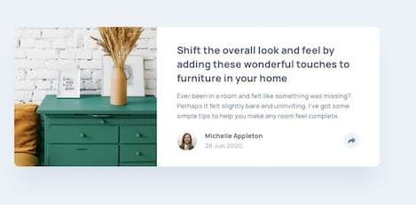

# Frontend Mentor - Article preview component solution

## Proceso

Construido con
- Marcado semántico HTML5
- Propiedades personalizadas de CSS
- Flexbox
- CSS Grid
- Flujo de trabajo que prioriza los dispositivos móviles (Mobile-first)

## Implementacion

Servidor alojado:
- Frontend Mentor - [@amigos81](https://www.frontendmentor.io/profile/amigos81)
- [GitHub Pages](https://github.com/amigos81/article-preview-component)
- [Netlify](https://funny-torte-73a258.netlify.app/)

## Autor

- Edward Quisocala M. 
- Email: sis.duar@gmail.com
